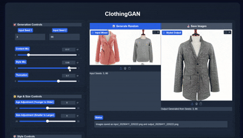

# ClothingGAN: AI Powered Clothing Design Generator
[](https://colab.research.google.com/github/mfrashad/ClothingGAN/blob/master/ClothingGAN_Demo.ipynb)
[](https://huggingface.co/spaces/mfrashad/ClothingGAN)


[Devpost Link](https://devpost.com/software/clothinggan) | [Youtube Video](https://www.youtube.com/watch?v=dHuunRnMnMo)

---

## Table of Contents
- [Features](#features)
- [Demo](#demo)
- [Inspiration](#inspiration)
- [What it does](#what-it-does)
- [How I built it](#how-i-built-it)
- [Installation](#installation)
- [Usage](#usage)
- [Project Structure](#project-structure)
- [Challenges I ran into](#challenges-i-ran-into)
- [What I learned](#what-i-learned)
- [What's next for ClothingGAN](#whats-next-for-clothinggan)
- [Contributing](#contributing)
- [License](#license)
- [Citation](#citation)

---

## Features
- Generate high-quality, realistic clothing images using StyleGAN2-ADA
- Mix and interpolate between different clothing styles and structures
- Edit generated clothing with semantic attributes (e.g., dark color, jacket, dress, coat)
- Interactive UI powered by Gradio for easy experimentation
- Support for both local and Colab-based usage
- Modular codebase for research and extension

## Demo
- **Colab Notebook:** [Open in Colab](https://colab.research.google.com/github/mfrashad/ClothingGAN/blob/master/ClothingGAN_Demo.ipynb)
- **Hugging Face Spaces:** [Try Online](https://huggingface.co/spaces/mfrashad/ClothingGAN)
- **Video Demo:** [YouTube](https://www.youtube.com/watch?v=dHuunRnMnMo)
- **Devpost:** [Project Page](https://devpost.com/software/clothinggan)



*Demo: Interactive clothing generation and editing*

---

## Inspiration
GANs (Generative Adversarial Networks) are generative models that learn the probability distribution of large image datasets. I have always found GANs fascinating, as they enable the creation of high-quality art and design without requiring technical or artistic drawing skills. While face editing with GANs is common, semantic manipulation in other domains is less explored. ClothingGAN was created to enable collaborative clothing design without high technical expertise.

## What it does
ClothingGAN generates clothing images and allows mixing between them. Users can control which structure or style to copy and edit generated clothing with attributes such as dark color, jacket, dress, or coat.

## How I built it
- Trained StyleGAN2-ADA on a subset of the Lookbook dataset (8,726 clothing images with clean backgrounds)
- Transfer learning from the FFHQ model
- Used GANSpace to discover interpretable directions in the latent space (unsupervised, no attribute classifier needed)
- Built an interactive UI with Gradio for easy deployment and experimentation

---

## Installation

### Prerequisites
- Python 3.7 or higher
- CUDA toolkit (for GPU support)
- NVIDIA drivers
- (Recommended) [Anaconda/Miniconda](https://docs.conda.io/en/latest/miniconda.html)

### Quick Start (Conda)
```bash
conda create -n clothinggan python=3.10
conda activate clothinggan
conda install pytorch torchvision torchaudio pytorch-cuda=11.8 -c pytorch -c nvidia
conda install -c conda-forge pycuda
pip install -r requirements.txt  # or use environment.yml
```

### Submodules & Extra Setup
```bash
git submodule update --init --recursive
python -c "import nltk; nltk.download('wordnet')"
```

For more details, see [INSTALL.md](INSTALL.md) and [SETUP.md](SETUP.md).

---

## Usage

### Interactive Viewer
```bash
python interactive.py
```

### Gradio Web UI
```bash
pip install gradio
python gradio_app.py
```

### Testing
```bash
python test.py
```

---

## Project Structure
```
ClothingGan/
├── clothing_gan.py         # Main GAN logic and Gradio interface
├── interactive.py          # Interactive viewer (Tkinter/Matplotlib)
├── models/                 # Model wrappers and architectures (StyleGAN2, BigGAN, etc.)
├── stylegan2/              # StyleGAN2-ADA code and weights
├── netdissect/             # NetDissect tools for model analysis
├── outputs/                # Generated outputs
├── tests/                  # Unit and integration tests
├── utils.py                # Utility functions
├── config.py               # Configuration management
├── README.md, INSTALL.md, SETUP.md
└── ...
```

---

## Challenges I ran into
One of the main challenges was fixing a memory leak issue that caused crashes. After extensive debugging, I identified and resolved the problematic code.

## What I learned
While I was already familiar with GANs, deploying ML models was intimidating. Gradio made deployment easy, though it has some customization limitations. I also explored alternatives like Streamlit and Dash.

## What's next for ClothingGAN
Potential future features:
- Appearance transfer
- Image inversion (upload & edit real images)
- Generating the fashion model itself
- Conditional text input (e.g., with OpenAI CLIP)

---

## Contributing
Contributions are welcome! Please open issues or pull requests for bug fixes, new features, or suggestions. For major changes, please discuss them in an issue first.

---

## License
This project is licensed under the [Apache License 2.0](LICENSE).

---

## Citation
```
@inproceedings{härkönen2020ganspace,
  title     = {GANSpace: Discovering Interpretable GAN Controls},
  author    = {Erik Härkönen and Aaron Hertzmann and Jaakko Lehtinen and Sylvain Paris},
  booktitle = {Proc. NeurIPS},
  year      = {2020}
}
```
